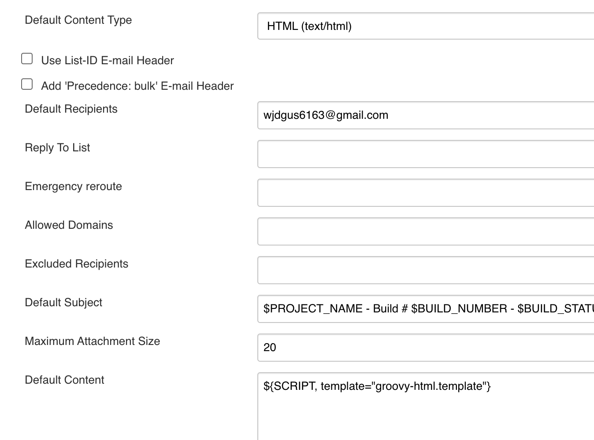
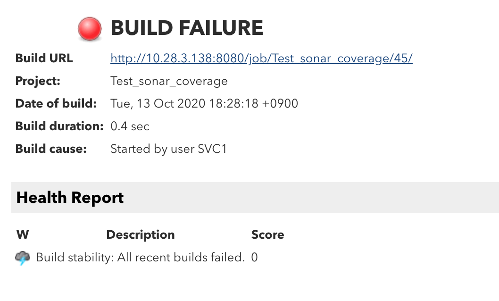
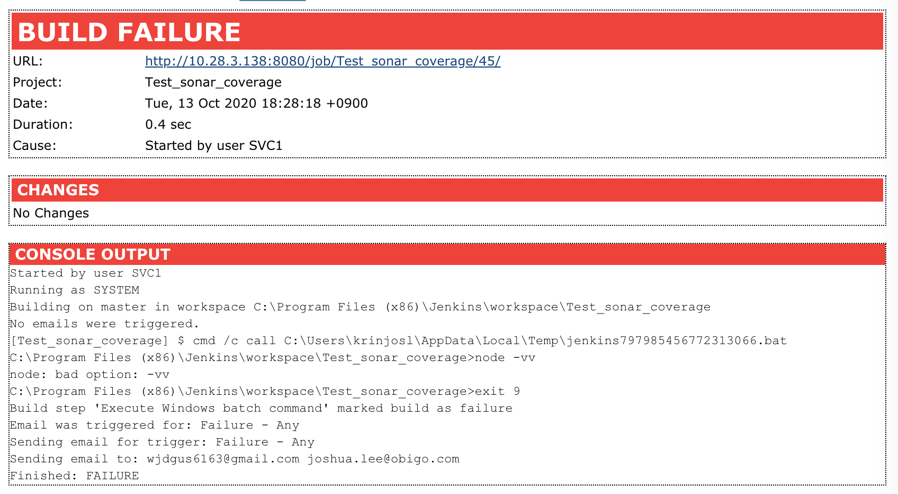

# Jenkins Email Extension 플러그인 사용
## 플러그인 설치
- Jenkins 관리 > 플러그인 관리
- Email Extension 설치
- Email Extension Template Plugin 설치

## 시스템 설정
- Jenkins 관리 > 시스템 설정 진입 > Extended E-mail Notification
- **SMTP server**
  - 서버의 IP/DNS를 입력
- **Default Content Type**
  - 메일을 보낼 형식을 지정 기본 값은 텍스트, HTML 도 가능
- **Add 'Precedence: bulk' Email Header**
  - 모든 이메일에 'Precedence: bulk'  를 붙여서 발신
  - 휴가를 가거나 부재중이라 자동 응답 메시지로 설정 했을 경우 수신자에게 발신되는 것을 방지
- **Default Recipients**
  - 기본 수신자 설정
  - 콤마를 구분자로 하여 여러 주소를 입력가능
  - 이 값은 $DEFAULT_RECIPIENTS 파라미터에 설정 됨
- **Reply To List**
  - 수신자가 답장할 경우 응답받을 이메일 주소를 설정
  - 자동 메일로 보내므로 수신자가 응답시 송신자 메일 주소를 바로 사용하면 안 되는 경우에 설정
  - 여러 개일 경우 콤마를 구분자로 사용
- **Excluded Recipients**
  - 메일을 보내지 않을 주소 설정
- **Default Subject**
  - 기본 제목 형식 설정
  - 기본 설정은 "$PROJECT_NAME - Build # $BUILD_NUMBER - $BUILD_STATUS!"
- **Maximum Attachment Size**
  - 첨부 파일의 최대 사이즈를 설정
  - MB 단위
  - 미 설정시 사이즈 제한이 없음
- **Default Content**
  - 기본 메일 내용
  - 기본 설정은 제목에 있는 내용과 빌드 내역을 상세하게 확인할 수 있는 URL 링크
  - Email Template 정의 가능
- **Default Pre-send Script**
  - 메일을 전송하기 전에 전용 스크립트를 통해 내용과 수신자등을 수정가능
  - 스크립트는 자바와 비슷하며 사전에 정의된 몇 가지 변수들이 있음
  - 아래는 빌드 실패시 이메일에 우선 순위 높음을 설정하는 예제
  ```
  if (build.result.toString().equals("FAILURE")) {
      msg.addHeader("X-Priority", "1 (Highest)");
      msg.addHeader("Importance", "High");
  }
  ```
- **Enable Debug Mode**
  - 디버깅 정보를 활성화

## Job 설정
- 빌드 후 조치항목에서 Editable Email Notification 선택
- **Project From**
  - 보내는 사람 입력
  - 기본적으로 시스템의 설정을 따름
  - 이메일 형태가 아니라면 정크메일로 분류됨
  - 예) SVC1 Jenkins <service1@obigo.com>
- **Project Recipient List**
  - 메일 받을 주소를 설정
  - 콤마를 구분자로 여러 개를 지정 가능
- **Project Reply-To List**
  - 수신자가 답변 메일을 보낼 주소를 설정
- **Content Type**
  - 본문 형식을 설정
  - 기본 값은 전역 설정
- **Default Subject**
  - 메일 제목 설정
  - 기본 값은 전역 설정
- **Default Content**
  - 메일 본문 설정
  - 기본 값은 전역 설정
- **Attachments**
  - 첨부 파일명을 설정
  - ant 의 fileset 형식을 따라서 기술 가능
- **Attach Build Log**
  - 빌드 로그 첨부 여부
- **Pre-send Script**
  - 이메일 전송전 실행할 스크립트를 설정
- **Save to Workspace**
  - 생성된 이메일을 작업공간에 저장 여부
  - 체크 시 "triggername-buildid.[txt|html]. 형식으로 저장
- **Triggers**
  - 어떤 이벤트 발생 시 누구에게 메일을 보낼 지 설정
  - Add 버튼 선택하여 Recipient List 추가
  - 고급... 버튼 선택
  - Recipient List 항목에 수신할 이메일 추가

## Email Extension Template Plugin 설정
$JENKINS_HOME/email-templates 경로 생성 후 template파일들을 위치시킨다.  
template파일은 .jelly/.template파일이며 github에서 검색하여 가져온다.  
Default Content 항목에 아래와 같이 지정한다.  


### jelly 사용 시
Default Content 항목에 ${JELLY_SCRIPT,template="detailed_email"} 입력


### template 사용 시 
Default Content 항목에 ${SCRIPT, template="groovy-html.template"} 입력


## 참고문서
[Email Extension Config](https://www.lesstif.com/continuous-integration/%ED%94%8C%EB%9F%AC%EA%B7%B8%EC%9D%B8%EC%9C%BC%EB%A1%9C-%EA%B8%B0%EB%8A%A5-%ED%99%95%EC%9E%A5-31851095.html)  
[Email Template](https://plugins.jenkins.io/email-ext/#Email-extplugin-Jellycontent)  
[jelly file](https://github.com/ironakpatel/jenkins-email-template)  
[template file](https://github.com/jenkinsci/email-ext-plugin/tree/master/docs/templates)