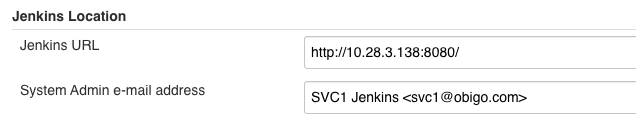
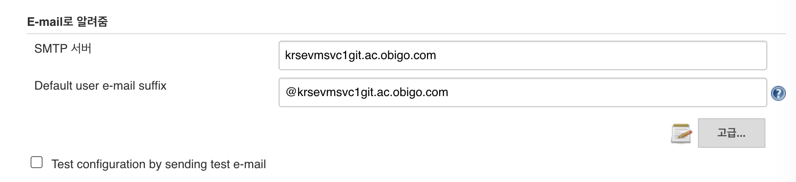
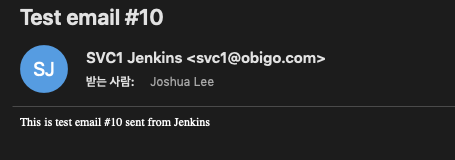
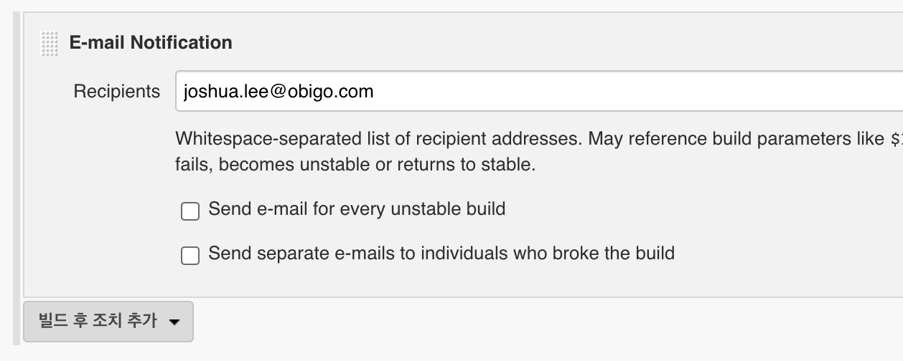
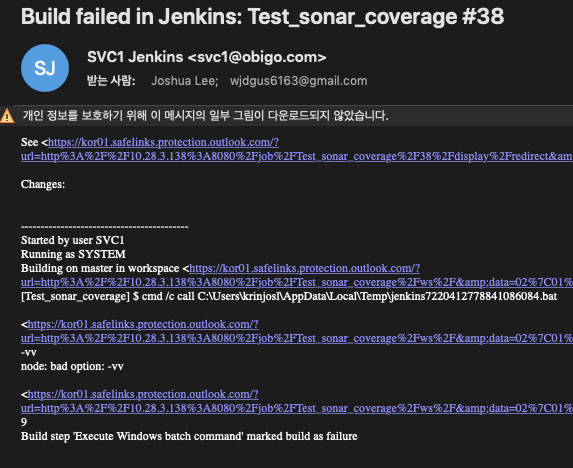
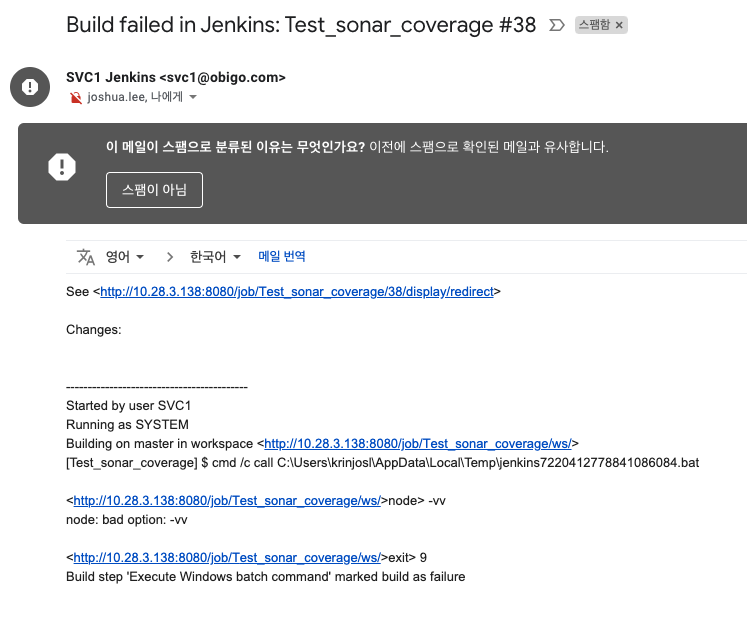

# Jenkins에서 이메일 연동

## SMTP 서버를 생성
Windows 서버에서 아래와 같이 SMTP 서버를 생성한다.

[Windows SMTP 서버 설정](https://server-talk.tistory.com/123)

SMTP 서버 설정 후 telnet으로 테스트는 아래와 같이 진행

[Telnet 테스트](https://jongjongbari.tistory.com/entry/windows2008-SMTP-%EC%84%A4%EC%A0%95)

gmail을 사용하지 않은 이유는 Jenkins에서 빌드시 설정한 gmail 계정으로 발신됨  
Jenkins에서 gmail을 SMTP 서버로 사용할 경우 전용 앱 password가 필요함  
전용 앱 password는 2차 보안 등록 후 gmail 를 발급할 수 있어 서비스1팀 팀계정 사용은 보류함  

## Jenkins 시스템 설정
Jenkins 관리 > 시스템 설정으로 진입한다.

1. Jenkins location
- 메일로 Jenkins의 URL이 전달될수 있으니 IP를 세팅한다.
- 시스템의 e-mail address 지정 (Email은 테스트를 위해 임의로 지정하였음)

2. E-mail Notification (E-mail로 알려줌)

- SMTP 서버의 IP or DNS를 지정
- Test configuration by sending test e-mail 항목으로 테스트 가능 (아래 이미지는 테스트 메일)

## Job 설정
빌드 후 조치에서 E-mail Notification 선택
전달할 메일 입력

Gmail에서는 아래와 같이 스팸메일로 분류되니 참고
