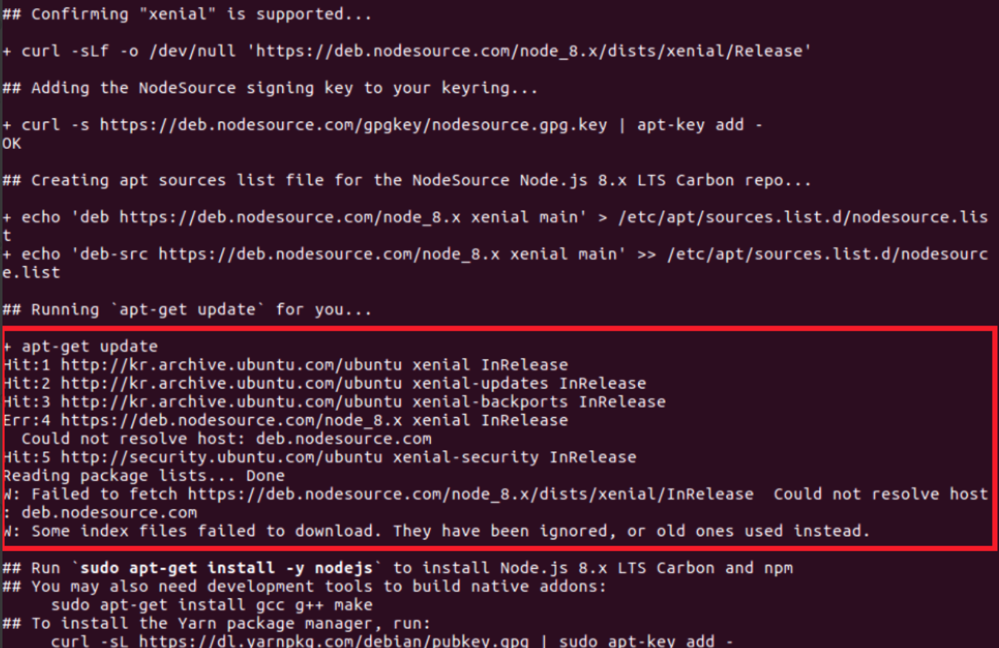

# Linux에서 Node.js 설치
## 설치하기
nodejs 설치 방법은 여러가지 있으며 nodesource로 설치하는 것을 권장함

**curl 설치 (command line 용 data transfer tool)**
```
apt-get install curl
```

**node 설치**

```
# Using Ubuntu
curl -sL https://deb.nodesource.com/setup_8.x | sudo -E bash - # 스크립트 실행
sudo apt-get install -y nodejs

# Using Debian, as root
curl -sL https://deb.nodesource.com/setup_8.x | bash -
apt-get install -y nodejs
```

## Node.js 설치 시 문제 해결
### curl로 스크립트를 실행할 때 apt-get update 하는 부분에서 Could not resolve host 에러가 발생


> ### 해결 방안
> 이 문제는 와이파이 환경에서 발생하였으며 랜선으로 대체하여 설치를 진행하였음 

### curl로 스크립트를 실행할 때 apt-get update하는 부분에서 404 not found가 발생

모종의 패키지가 서버로 부터 연결이 끊어지거나 요청한 내용을 찾을 수 없을 경우 apt-get update가 실패하게 됨

따라서 curl을 통한 nodesource 스크립트가 실패함

> ### 해결 방안
> All Settings > Sofware & Update > Other Software 탭 > 404 not found가 발생한 패키지를 비활성화 처리

## nodesource로 Node.js 설치를 권장하는 이유
nvm으로 설치를 할 경우 실제 바이너리는 ~/.nvm/versions/node/ 의 위치에 설치한 각 버전별로 위치하게 된다.

그리고 이에 대한 환경변수는 .bashrc 파일을 통하여 추가되도록 가이드하고 있다. 사용자 환경변수로 추가되는 것이며 특정사용자가 엑세스함

설치파일을 더블클릭하여 실행할 경우 아래와 같은 문제가 발생할 수 있다. → **UNIX 계열의 운영체제에서 발생하며 macOS에서도 발생한다.**

예시)

node --version 를 실행하여 node의 버전을 반환하는 것을 실행한다.

이때 터미널에서는 올바르게 버전이 표시된다.

내부적으로 node --version을 실행하여 버전에 대한 유효성 검사를 하는 GUI 프로그램이 있다고 가정한다.

GUI 프로그램을 더블클릭하여 실행한 경우 이 프로그램은 node를 찾지 못하고 에러를 반환한다.
(GUI 프로그램을 터미널에서 명령줄로 실행한 경우에는 node를 잘 찾는다.)

더블클릭하여 파일을 실행할 경우 환경변수를 제대로 찾지 못하여 node가 존재하지않는다고 판단 (더블클릭이 아닌 shell로 실행할 경우 정상동작)
> ### 해결방안
> /etc/environment 혹은 /etc/bash.bashrc, /etc/profile 에서 시스템 환경변수로 추가한다. 이 경우 더블클릭하여 실행한 GUI 프로그램이 제대로 환경변수를 찾는다.

## 참고문서
[Node.js 설치](https://github.com/nodesource/distributions#debinstall)

[apt-get update 시 에러 - Could not resolve host](https://onedaystudy.tistory.com/109)

[apt-get update 시 에러 - 404 not found](https://askubuntu.com/questions/65911/how-can-i-fix-a-404-error-when-using-a-ppa-or-updating-my-package-lists)

[GUI 프로그램 동작을 위한 환경변수 설정](https://superuser.com/questions/555081/ubuntu-environment-setting-for-gui-session-or-making-the-same-with-terminal)

[GUI 프로그램이 바라보는 환경변수 확인](https://askubuntu.com/questions/275965/how-to-list-all-variables-names-and-their-current-values/356973#356973)