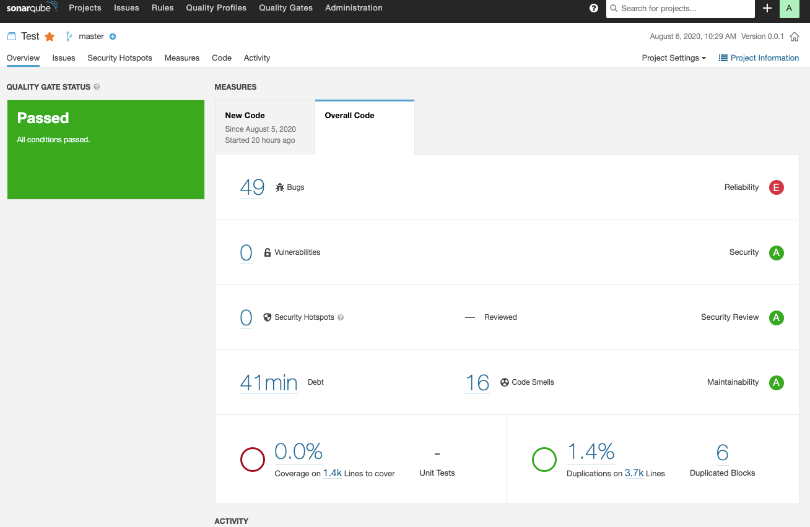

# Jenkins 연동

아래는 SonarQube와 Jenkins를 연동하는 방법에 대해 설명한다.

## Sonar Scanner 설치
Jenkins와 연동할 목적이므로 Jenkins Plugin으로 추가
- Jenkins 관리 > 플러그인 관리 > 설치가능 탭 > SonarQube Scanner 설치

**scanner를 설치**
- Global Tool Configuration에서 아래 이미지와 같이 설정 (Install automatically를 선택)


## Jenkins 구성
### credential 추가
- [Token](./Token_생성.md) 생성 에서 생성한 token을 jenkins에서 credential로 추가한다.
- Kind 항목은 Secret text 선택
- Secret 항목에 SonarQube에서 생성한 token값을 입력
- ID에 credential 명 기입
- 

### Server 설정 추가
- Jenkins 관리 > 시스템 설정 > SonarQube servers
- Add SonarQube 버튼을 선택
- Server authentication token에서 credential 선택
- 

> Server URL을 입력하않으면 localhost:9000으로 동작한다.
>
> Jenkins와 SonarQube가 특정서버에 있는 경우 명시적으로 URL을 입력하는 것이 좋다.
>
> 왜냐하면 Jenkins에서 SonarQube로 설정한 URL로 진입이 가능하다.
>
> 클라이언트에서 서버의 Jenkins에 접속하여 SonarQube를 진입 시 localhost로 설정되어 있다면 클라이언트의 localhost로 찾기 때문이다.

### Jenkins 프로젝트 구성
- 정적분석을 진행할 프로젝트 선택 > 구성 > Build > Execute SonarQube Scanner 선택
- Analysis properties에 다음과 같이 추가
  ```
  sonar.projectKey=StaticAnalysisProject # sonarqube의 프로젝트 명이며 sonarqube에 해당 프로젝트가 없다면 새로 생성된다.
  sonar.projectVersion=0.0.1
  sonar.language=javascript
  sonar.sources=podcast/src # 테스트를 진행할 특정 path를 지정한다.
  sonar.exclusions= # 분석에서 제외할 파일
  # inclusions는 테스트 결과 동작하지 않음
  ```
- 
- 옵션에 대해서는 아래를 참고
- https://docs.sonarqube.org/latest/analysis/analysis-parameters/

### 동작 확인



## 참고 문서
[젠킨스 구성](https://cubenuri.tistory.com/222)  
[젠킨스 구성 및 credential 참고](https://tech.osci.kr/2020/02/07/86045772/)