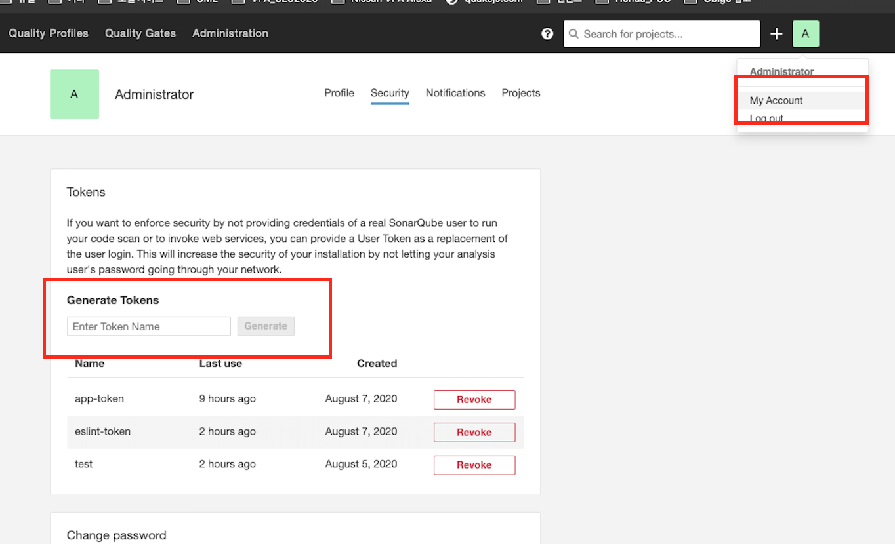

# Token 생성
SonarQube 생성 시 계정은 admin/admin으로 설정되어 있다.

**토큰 생성**
- 우측 상단 User 선택 > My account > Security > Tokens 에서 Token 생성
- token 값은 사용할 것이므로 copy

**프로젝트 생성**
- Jenkins 혹은 SonarQube와 연동된 곳에서 분석 시 자동생성되기 때문에 무조건적으로 생성할 필요는 없음