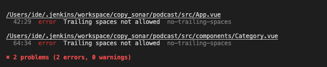
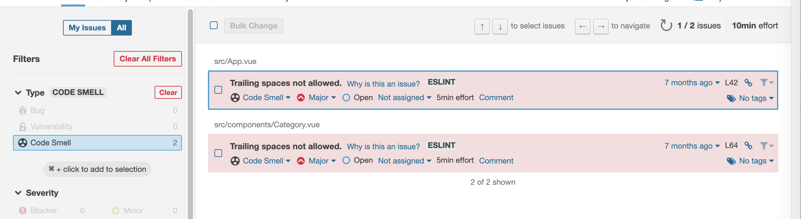
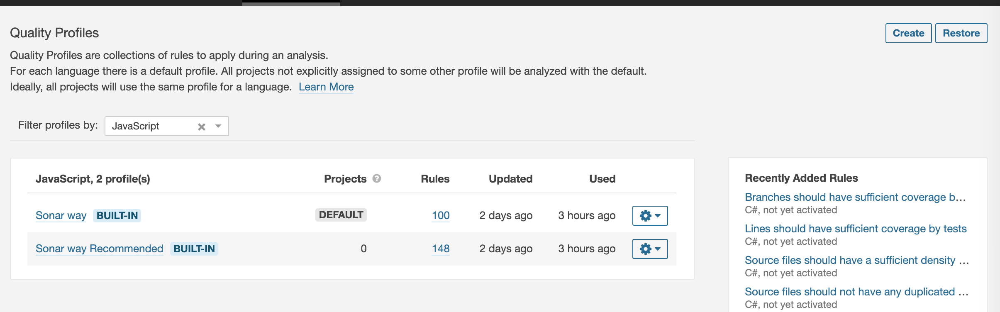
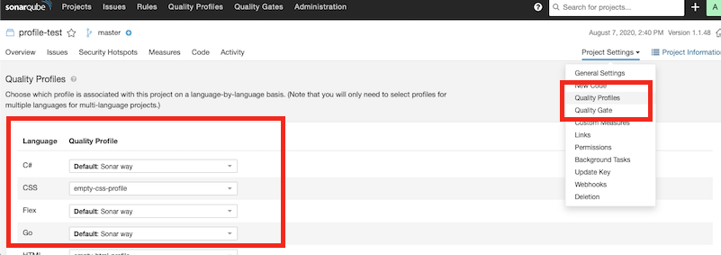
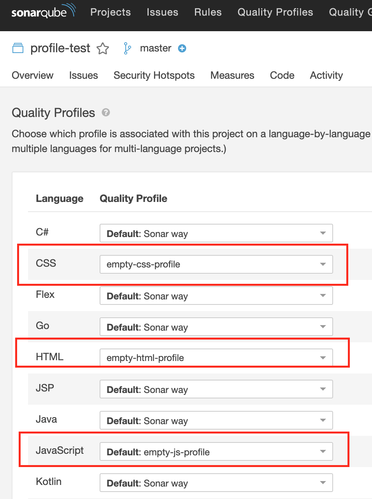

# 코딩 Rule 적용

## ESLint 적용
ESLint는 SonarQube에서 위 Profile을 기반으로 분석할 때 같이 동작하는 것이 아니라  
ESLint 결과 파일을 가져와 위의 분석결과와 같이 보여주는 형태이다.

> ESLint 실행    →    SonarQube 분석 시 Lint 결과 import

## ESLint 실행
```
$ eslint -f json -o result.json --ext .js,.vue src
# jenkins에서 실행 시 lint 결과에 error가 포함되어있으면 빌드가 실패할수 있으므로 명시적으로 아래와 같이 exit 0을 해준다.
# eslint -f json -o result.json --ext .js,.vue src || exit 0
```
SonarQube 실행 시 옵션 추가
```
sonar.eslint.reportPaths: result.json # Jenkins 또는 프로젝트에서 추가
```

> ### SonarQube의 전역 설정에 eslint 설정이 존재하는지 확인 필요
>
> - Administration > Configuration > External Analyzers > Javascript/TypeScript > ESLint Report Files에 값이 있다면 이 값으로만 동작하기 때문에 확인

## ESLint 적용 예시
SonarQube에서 Lint 결과를 제대로 보여주는지 확인하기 위하여 아래 파일들에 Lint에러를 발생시켰다.
- App.vue
- component/Category.vue



Lint 결과로 하여금 SonarQube에 반영 시 아래와 같이 Code Smell 항목에 표시되는 것을 확인할 수 있다.



## Quality Profiles
**Quality Profiles**란 SonarQube의 Rule들의 프리셋이라 생각하면된다. (많은 Rule을 하나로 모아놓은 코어 컴포넌트)  
빌트인으로 Sonar Way라는 Quality Profile 을 포함하여 분석에 사용된다.

### Quality Profiles 생성
Quality Profiles 탭에서 Filter profiles by 에서 javascript를 선택하면 기본 프로파일을 확인할 수 있다.  
아래 이미지에서 확인할 수 있듯이 프로파일 내에 많은 rule을 포함하고 있다.



생성은 다음과 같다.
- 우측 상단의 Create 버튼 선택
- 언어 선택
- 상속받을 프로파일 선택

### Quality Profiles 적용
프로젝트 내에 Project Settings > Quality Profiles에서 언어별로 프로파일을 선택할 수 있다.



### SonarQube 기본 규칙 비활성화
SonarQube의 기본 규칙을 사용하지 않고 eslint 결과 값만 확인하고 싶다면 아래와 같이 진행한다.

- Quality Profiles 탭에서 CSS, HTML, Javascript 각각 빈 프로파일을 생성한다. (상속받지 않고 생성)
- 해당 프로젝트에서 Project Settings > Quality Profiles 진입한다.
- CSS, HTML, Javascript 에 생성한 빈 프로파일을 선택한다.


## Code Coverage 적용
ESLint와 마찬가지로 Code Coverage도 SonarQube에서  
Coverage 결과 파일을 가져와 위의 분석결과와 같이 보여주는 형태이다.

> Code Coverage 실행    →    SonarQube 분석 시 Coverage 결과 import

lcov.info파일을 job 설정에서 지정한다.  
- 프로젝트 설정 > Execute SonarQube Scanner > Analysis properties 에 다음과 같이 입력
- "sonar.javascript.lcov.reportPaths={coverage report path}/lcov.info" 추가