# Windows에서 Codesign 하기

## signtool command line 사용
1. USB 토큰 연결
2. 토큰 연결시 아래와 같이 SafeNet Authentication Client Tools에 토큰이 보여진다.
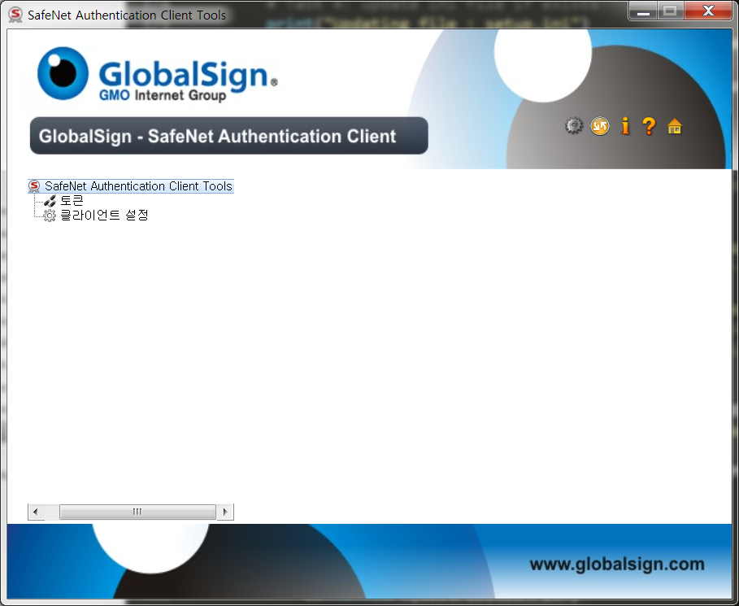
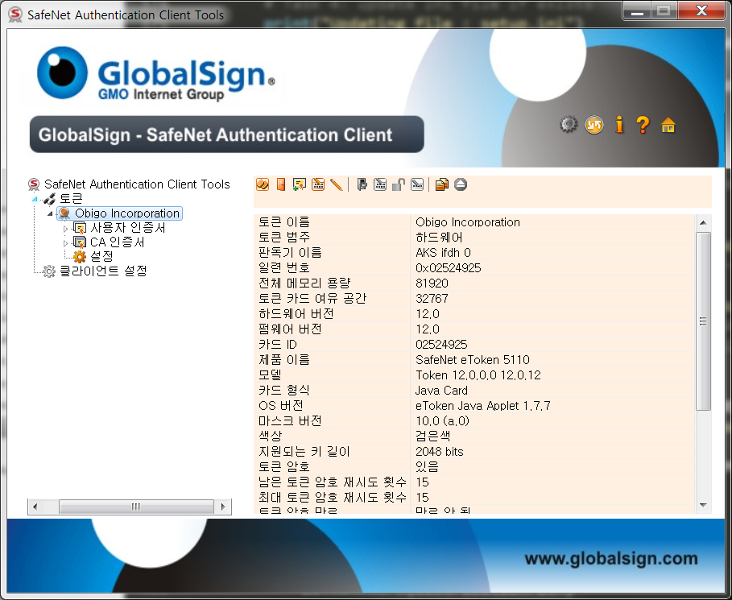

3. 인증서의 서명 알고리즘이 sha256라면 sha256으로 signing 한다.
```
$ signtool sign /a /s MY /n "인증서 게시자 명" /as /fd sha256 /tr http://timestamp.globalsign.com/?signature=sha2 /td SHA256 서명할 파일 명
# ex) signtool sign /a /s MY /n "Incorporation" /as /fd sha256 /tr http://timestamp.globalsign.com/?signature=sha2 /td SHA256 C:\Users\krinjosl\Desktop\Test_v0.0.1.exe
```

4. signtool.exe는 C:\Program Files (x86)\Windows Kits\8.1\bin\x64에 있으며 없다면 PDF파일(*GlobalSign-Install CodeSign_ver1.8.pdf*) 참고하여 설치
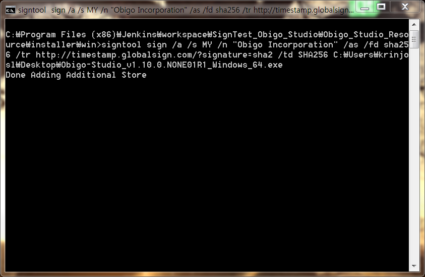
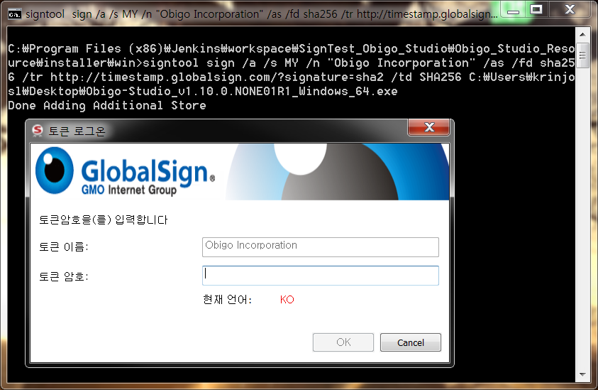

5. 암호 입력 후 codesign을 진행한 파일을 오른쪽 클리하여 속성을 클릭
6. 기존에 존재하지 않던 디지털 서명이라는 탭이 생긴 것을 볼 수 있다.

## Innosetup 패키징 시 signtool 사용
1. Inno Script Studio 에서 signtool 사용
- Inno Script Studio > Tools > Configure Sign Tools... 를 클릭
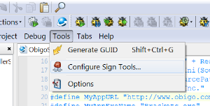
- Add를 누르면 아래와 같이 나온다.  
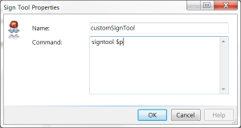

- [Setup] 섹션에서 사용할 sign tool의 이름과 Command를 구성한다. (위 이미지의 Command의 signtool은 실제 환경변수에 등록해놓은 signtool.exe를 호출하는 커맨드이며 $p는 [Setup] 섹션에서 실제 signtool.exe 커맨드를 파라미터로 받기 위한 옵션)  
- [Setup] 섹션에 아래와 같이 추가한다. customSignTool은 방금 구성한 sign tool이며 뒤의 커맨드는 실제 command이다.
```
SignTool=customSignTool sign /a /s MY /n $q<인증서 게시자>$q /as /fd sha256 /tr http://timestamp.globalsign.com/?signature=sha2 /td SHA256 $f
```
- [Setup] 섹션에 sign tool을 구성하지 않으면 제대로 동작하지 않는다.

2. Inno Setup Command Line Compiler 사용 
- iss파일에 sign tool 구성은 하지않고 아래와 같이 저장한다. 
```
SignTool=customSignTool sign /a /s MY /n $q<인증서 게시자>$q /as /fd sha256 /tr http://timestamp.globalsign.com/?signature=sha2 /td SHA256 $f
```
- iscc /S"signtool name"="signtool command" "파일명" 으로 실행  
```
iscc /ScustomSignTool="signtool $p" <스크립트 파일>.iss
```

## Jenkins에 적용
### Jenkins slave란?  
- jenkins는 여러가지 환경에서 빌드의 필요성과 크고 무거운 프로젝트의 구축으로 인한 문제를 해결하기 위해 분산 아키텍처가 도입되었다.  
- 아키텍처는 jenkins master-slave 이며 빌드를 분리하여 관리하며 master와 slave는 TCP/IP 프로토콜을 통해 통신을 한다.  
- jenkins server가 master 역할을 하며 빌드 예약을 받고 실제 빌드를 slave로 보낸다.  
- slave는 원격 컴퓨터에서 실행되는 java 실행파일이며 master 인스턴스의 요청을 받고 실제 빌드 작업을 실행하며 다양한 운영체제에서 빌드할 수 있다. (Windows, mac, linux 등)

### slave-agent 추가
- Jenkins 관리 > 노드 관리 > 신규 노드
- 노드 명 입력과 Permanent Agent 체크 후 아래 그림과 같은 화면을 볼 수 있다.
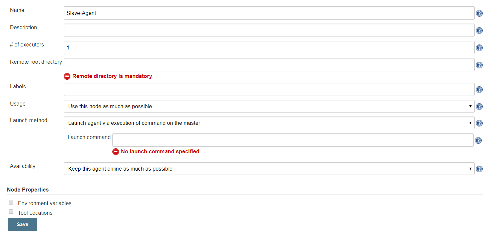
- Remote root directory 는 slave-agent가 연결된 프로젝트를 빌드하게 되면 workspace가 생성되는 path이다.  
- Labels는 agent와 프로젝트간의 연결 매개체이다.
- Launch method는 ~~Launch agent via Java Web Start를 선택한다.~~ → **Launch agent by connecting it to the master 선택하면 된다.**
  - Launch agent via Java Web Start가 없을 경우에 Jenkins 관리 > Configure Global Security 클릭
  - Agents 의 Fixed를 체크 후 사용할 포트 번호를 입력하거나 random 체크
  - Launch method에 Launch agent via Java Web Start가 생성된 것을 확인 가능하다.
save버튼 클릭 후 아래와 같은 화면을 볼 수 있다.
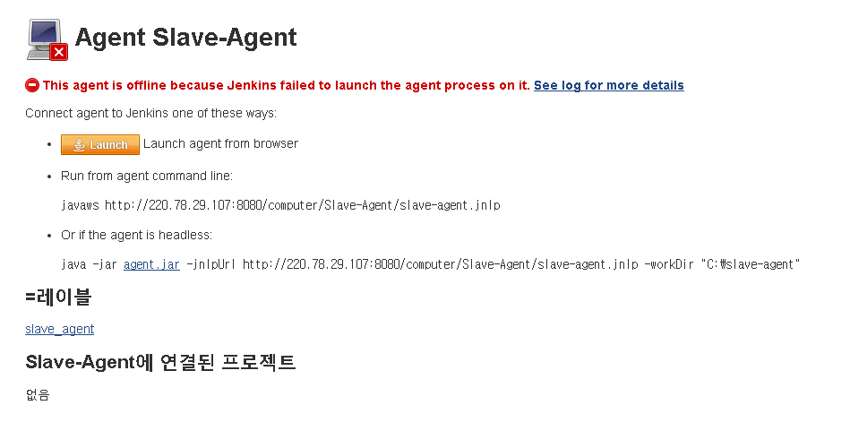

- ~~Launch 버튼 클릭하여 jnlp파일을 다운로드 받는다.~~
- ~~Java가 없다면 설치를 하고 낮은 버전일 경우 jnlp파일을 실행시킬때 업데이트를 할 것이다.~~
- ~~jnlp파일을 실행시킨다면 아래와 같이 실행된 agent를 볼 수 있다.~~
- .jnlp를 다운받아 실행하는 방법은 Oracle JDK의 javaws 바이너리를 사용하여 실행할수 있다.
- 하지만 Oracle JDK는 라이센스 문제가 있을수 있으므로 OpenJDK 혹은 ZuluJDK로 대체한다.
- **OpenJDK 혹은 ZuluJDK 사용 시 javaws 바이너리를 포함하지 않고 있어 .jnlp를 다운받아 실행하는 방법은 사용이 불가하다.**
- 다른 방법은 명령행에서 JavaWS 실행하는 방법이다.
- 위 화면에서 agent.jar파일을 다운로드 받고 해당 명령을 실행한다.
> ### 참고
> agent가 동작하는 workspace의 소유권 문제로 인하여 connected가 되지 않을 수 있다.

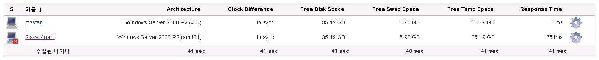
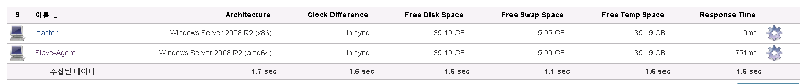

### job설정 
agent와 연결할 프로젝트의 구성에서 Restrict where this project can be run을 체크하고 agent의 Labels를 입력한다.
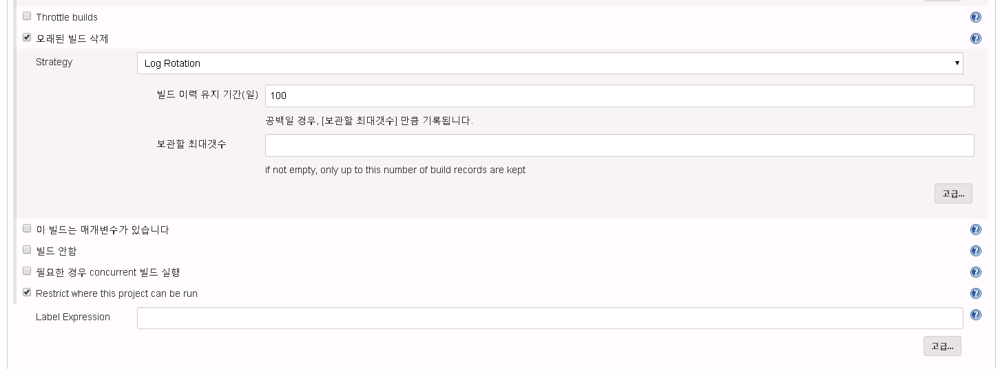

## 참고 문서
[innosetup signtool 사용법](http://www.jrsoftware.org/ishelp/index.php?topic=compilercmdline)  
[jenkins master-slave 아키텍처](https://www.edureka.co/blog/jenkins-tutorial/)  
[jenkins에서 usb token사용하여 signtool 동작 안되는 현상 해결법](https://groups.google.com/forum/#!msg/jenkinsci-users/RQyUWZilrRE/CXcKW_MeMwAJ)  
