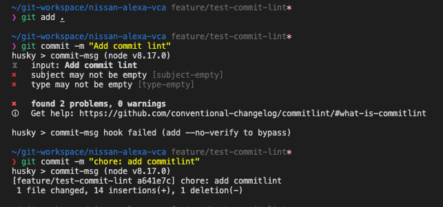
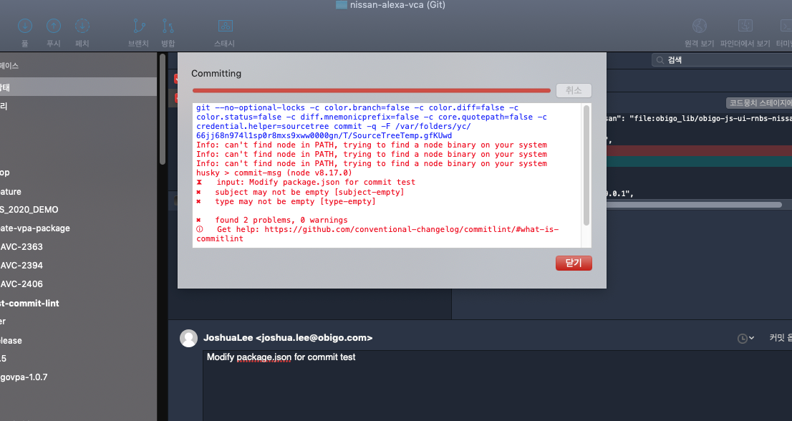
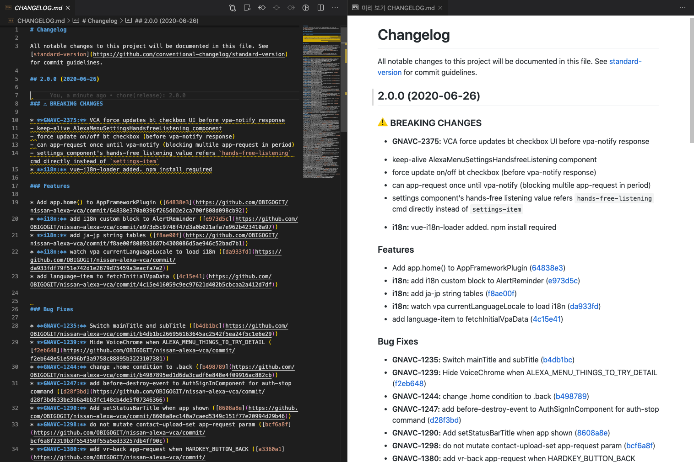

# Commit 메세지 lint 하기

여러 개발자가 1개의 프로젝트를 같이 진행할 경우 커밋 메세지도 스타일이 달라 제각각이다.  
간략하게 한줄을 쓰는 개발자도 있는 반면 여러줄로 명확히 쓰는사람도 있을 것이기 때문에  
커밋 메세지 컨벤션을 정하더라도 메세지에 일관성을 유지하기는 어렵다.  
따라서 커밋 메세지를 lint 하는 법에 대해 설명한다.  

## Commit Rule
스타일은 Conventional Commits를 적용하였다. (lint를 할수 있는 모듈이 존재함)  
자세한 사항은 다음을 참고  
https://www.conventionalcommits.org/en/v1.0.0/

> \<type\>[optional scope]: \<description\>  
> [optional body]  
> [optional footer(s)]  

아래와 같이 전체적인 메세지의 구성은 header, body, footer로 나뉜다. 각 항목의 경계는 빈 줄을 넣는다.
- header: 커밋 한줄 요약
- body: 이슈의 원인이나 수정 내용 등
- footer: reporter나 signer를 기록

## Header Type
Header Type | Description
:---|:---|
fix | 기능 변경 없이 bug fix 정도의 수정
feat | 새로운 feature 추가
refactor | 코드 리팩토링
docs | 문서 수정
test | 테스트 코드 수정
chore	| 자잘한 수정 사항
style	| 스타일 수정
위 표 이외에 build, ci, perf, revert 타입이 존재함

### 예시

> feat: allow provided config object to extend other configs
>
> BREAKING CHANGE: `extends` key in config file is now used for extending other config files
-------------
> feat(lang): add polish language
-------------
> fix: correct minor typos in code
>
> see the issue for details
>
> on typos fixed.
>
> Reviewed-by: Z  
> Refs #133

## Lint 구성
### 모듈 설치

commitlint 모듈을 사용하여 커밋 메세지 lint를 실행한다.  
husky 모듈은 git hook을 디스패치하여 commitlint를 실행할 수 있게 해주는 모듈이다.
```
# husky3버전대를 설치하는 이유는 4버전대에서 lint가 제대로 되지 않는 현상이 있음
# husky 모듈 설치 전에 프로젝트 내에 .git/hooks 디렉토리를 제거한다. (기존 hook이 있는 경우 정상동작하지않기 때문에 husky에서 설치하는 hook을 사용)
$ rm -rf .git/hooks
$ npm i -D @commitlint/{cli,config-conventional} husky@3
```

### 프로젝트 구성
#### commitlint 구성

commitlint 구성방법은 설정파일을 생성하거나 package.json에 설정을 추가하면 된다.
```
# 설정파일 생성
$ echo "module.exports = {extends: ['@commitlint/config-conventional']};" > commitlint.config.js
```
or
```
// package.json
{
  "commitlint": {
    "extends": [
      "@commitlint/config-conventional"
    ]
  }
}
```
#### husky 구성
```
// package.json
{
  "husky": {
    "hooks": {
      "commit-msg": "commitlint -E HUSKY_GIT_PARAMS"
    }
  }
}
```

#### 실행 결과


임의의 커밋메세지를 시도하면 에러를 반환하며 Conventional Commits Rule에 맞추는 경우 통과

GUI 프로그램(Sourcetree) 사용 하더라도 에러를 반환

## Change Log & Release
standard-version 모듈을 사용하여 앱을 릴리즈 시 커밋사항을 확인하여  
package.json의 버전을 자동으로 올려주고 버전 별로 수정사항 및 추가된 feature 등 release note를 작성해준다.

### 모듈 설치
```
$ npm i -D standard-version
```

### 프로젝트 구성 및 실행
```
// package.json
{
  "scripts": {
    "release": "standard-version"
  }
}
```
```
$ npm run release
```
release 스크립트 실행 결과로는 다음과 같다.

- package화 된 tar 파일
- CHANGELOG.md
- 태깅
- 

> 커밋 메세지의 header type중 fix 가 있을 경우 package.json의 PATCH 버전이 올라간다.  
> 커밋 메세지의 header type중 feat 가 있을 경우 package.json의 MINOR 버전이 올라간다.  
> header의 type에 관계없이 BREAKING CHANGE 항목이 있다면  package.json의 MAJOR 버전이 올라간다.

## 참고문서
[Semver (semantic versioning)](https://semver.org/#summary)  
[쿡앱스 기술블로그](https://blog.cookapps.io/guide/conventional-commits/#%EA%B0%9C%EC%9A%94)  
[husky 모듈 없이 commitlint 사용하기](https://dzone.com/articles/using-conventional-commit-in-project)  
[standard-version 모듈없이 CHANGELOG.md 생성하기](https://github.com/conventional-changelog/conventional-changelog/tree/master/packages/conventional-changelog-cli)  
[Commit History를 효과적으로 관리하기](https://medium.com/hdackorea/commit-history%EB%A5%BC-%ED%9A%A8%EA%B3%BC%EC%A0%81%EC%9C%BC%EB%A1%9C-%EA%B4%80%EB%A6%AC%ED%95%98%EA%B8%B0-%EC%9C%84%ED%95%9C-%EA%B7%9C%EC%95%BD-conventional-commits-67b2114ac8e4)