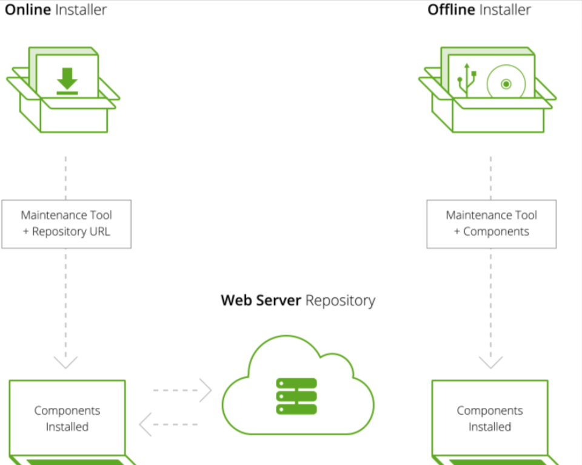
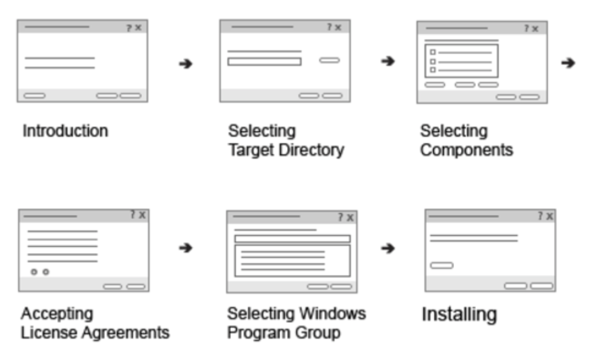
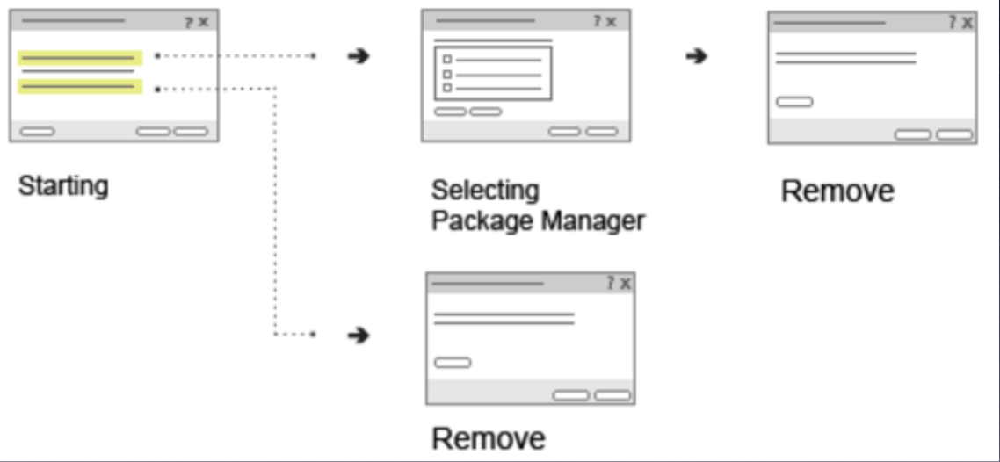
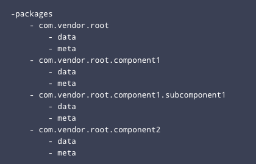

# QT Installer Framework
QT Installer Framework에 대하여 설명한다.

## QT Installer Framework란?
- installer를 생성할 수 있도록 유틸리티와 도구를 제공한다.
- 하나의 소스코드로 모든 플랫폼에 대응가능하다. (Windows, Linux, macOS 를 지원)
- Linux는 x window system의 xlib를 기반으로 qtifw가 개발 되었다.
- Linux 시스템에 xlib가 존재하여야 qtifw가 정상적으로 수행이 가능하다.

## Installer Type
두 인스톨러는 추후에 구성요소를 add, update, remove 할수 있도록 maintenance tool을 설치

### offline
- 설치 가능한 모든 구성요소 포함
- 네트워크 불필요

### online
- maintenance tool만 설치
- 구성요소는 online repository에서 내려받음

## Installer Flow
### Installer

- **Introduction**
- **Selecting Target Directory**
  - 사용자가 설치 대생 path를 지정할 수 있는 페이지
  - config.xml에서 기본값을 지정 가능
  - path가 존재하지 않는다면 에러팝업을 표시함
- **Selecting Component**
  - 구성요소를 간략하게 설명
  - meta 디렉토리의 package.xml에서 정보를 지정
- **Accepting License Agreements**
-   package.xml과 meta 디렉토리 내에 license 파일을 지정
- **Selecting Windows Program Group**
  - Windows에서 시작 메뉴 디렉토리 선택 페이지를 지정하면 Windows 시작메뉴에서 제품의 프로그램 그룹을 선택할 수 있음
  - config.xml에서 그룹의 기본값을 설정

## Uninstaller

## config.xml
설치 프로그램의 UI 및 동작을 정의한다.   
설정값은 아래에서 참고한다.   
https://doc.qt.io/qtinstallerframework/ifw-globalconfig.html

## Package 디렉토리 구조
- 모든 Component 는 package 디렉토리에 동일한 root 디렉토리에 위치해야한다.
- 디렉토리 이름은 모든 구성요소를 식별하는 역할을 한다.
- ex) com.vender.root
- root 디렉토리에서 data 및 meta라는 서브 디렉토리를 생성해야한다.

## meta 디렉토리
배치 및 설치 프로세스에 대한 설정을 지정하는 파일이 들어 있다.   
디렉토리에는 최소한 패키지 정보 파일과 스크립트 정보, 사용자 인터페이스 파일 및 변환과 같이 패키지 정보 파 일에서 참조하는 모든 파일이 있어야한다.   

## package.xml
설치파일로 제공하려는 패키지의 정보를 명시한다.   
설정값은 아래에서 참고한다.   
[Package Directory](https://doc.qt.io/qtinstallerframework/ifw-component-description.html)

## Scripting
[Controller Scripting](http://doc.qt.io/qtinstallerframework/noninteractive.html)   
[Component Scripting](http://doc.qt.io/qtinstallerframework/scripting.html)   
[Operations](http://doc.qt.io/qtinstallerframework/operations.html)   
[Scripting API](http://doc.qt.io/qtinstallerframework/scripting-qmlmodule.html)   
[C++ API](http://doc.qt.io/qtinstallerframework/ifw-cpp-classes.html)   
[gui](http://doc.qt.io/qtinstallerframework/scripting-gui.html)   
[buttons](http://doc.qt.io/qtinstallerframework/scripting-buttons.html)   
[installer](http://doc.qt.io/qtinstallerframework/scripting-installer.html)   
[QInstaller](http://doc.qt.io/qtinstallerframework/scripting-qinstaller.html)   
[QMessage](http://doc.qt.io/qtinstallerframework/scripting-qmessagebox.html#warning-method)   

## 참고 문서

[QT Installer Guide](http://tvaira.free.fr/dev/methodologie/deploiement_qtinstaller)