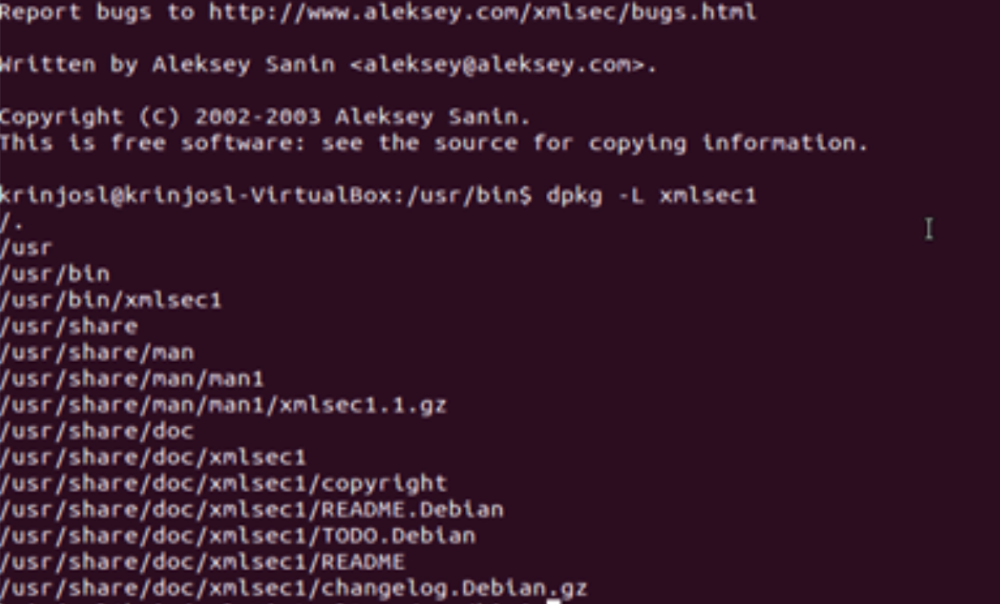

# xmlsec1

서명시에 xmlsec1이라는 라이브러리를 사용하여 파일들을 서명한다.

## macOS용 xmlsec1 정적 컴파일
```
# homebrew 설치 (linux의 apt-get과 같은 package manager)
$ ruby -e "$(curl -fsSL https://raw.githubusercontent.com/Homebrew/install/master/install)" < /dev/null 2> /dev/null
```

```
# xmlsec1 설치
$ brew install xmlsec1
$ brew link --overwrite libxmlsec1
```

macOS에서는 위 방법과 같이 homebrew를 통하여 설치를 진행한다.

## Linux용 xmlsec1 정적 컴파일
```
# xmlsec1 설치 (이 방법으로 설치 시 1.2.18 버전이 설치 되기 때문에 보다 최신버전이 필요한 경우 직접 컴파일해야한다.)
sudo apt-get update
sudo apt-get install xmlsec1
```
위와 같이 설치 시 global하게 사용할 수 있다.



dpkg -L xmlsec1 입력 시 설치된 디렉토리 구조를 볼 수 있다.


### xmlsec1 v1.2.24 빌드
#### 의존성 설치
1. python v2.7.13 설치
```
wget https://www.python.org/ftp/python/2.7.13/Python-2.7.13.tar.xz
tar xvfJ Python-2.7.13.tar.xz
cd Python-2.7.13/
./configure --prefix= (빌드 결과물이 참조할 의존성 위치) --enable-shared --with-system-expat --with-system-ffi --with-ensurepip=yes --enable-unicode=ucs4 && make
sudo make install
```
의존성 위치 예) --prefix=/usr/local/python

2. openssl 설치
```
wget https://openssl.org/source/openssl-1.0.2h.tar.gz
tar xvzf openssl-1.0.2h.tar.gz
cd openssl-1.0.2h/
./config --prefix=(빌드 결과물이 참조할 의존성 위치)         \
         --libdir=lib          \
         shared                \
         zlib-dynamic &&
make depend           &&
make
sed -i 's# libcrypto.a##;s# libssl.a##' Makefile
make MANDIR=(prefix)/share/man MANSUFFIX=ssl install &&
install -dv -m755 (prefix)/share/doc/openssl-1.0.2h  &&
cp -vfr doc/*     (prefix)/share/doc/openssl-1.0.2h
```
3. libxml2 v2.9.4 설치
```
wget http://xmlsoft.org/sources/libxml2-2.9.4.tar.gz
tar xvzf libxml2-2.9.4.tar.gz
cd libxml2-2.9.4/
sed -i "/seems to be moved/s/^/#/" ltmain.sh && ./configure --prefix=(빌드 결과물이 참조할 의존성 위치) --disable-static --with-history --with-python= (Python 빌드 시 의존성 위치) && make
sudo make install
```
의존성 위치 예) --prefix=/usr/local/libxml2


4. libxslt v1.1.29 설치
```
wget http://xmlsoft.org/sources/libxslt-1.1.29.tar.gz
tar xvzf libxslt-1.1.29.tar.gz
cd libxslt-1.1.29/
sed -i "/seems to be moved/s/^/#/" ltmain.sh && ./configure --prefix= (빌드 결과물이 참조할 의존성 위치) --disable-static --with-libxml-prefix= (libxml2 빌드 시 의존성 위치) && make
sudo make install
```
의존성 위치 예) --prefix=/usr/local/libxslt


5. xmlsec1 v1.2.24 설치
```
wget http://www.aleksey.com/xmlsec/download/xmlsec1-1.2.24.tar.gz
tar xvzf xmlsec1-1.2.24.tar.gz
cd xmlsec1-1.2.24/
./configure --prefix= (빌드 결과물이 참조할 의존성 위치) --libdir=prefix/lib  --with-libxml= prefix/libxml2 --with-libxslt= prefix/libxslt --with-openssl=prefix/openssl --with-default-crypto=openssl && make
sudo make install
```
(prefix와 관계없이 따로 결과물들을 받고 싶다면 DESTDIR 옵션 사용 - sudo make DESTDIR="$HOME/Documents/xmlsecTest" install)


> ## known issue
> 시스템에 1.1.23버전의 xmlsec1이 설치되어있으면 정적 컴파일한 xmlsec1 v1.1.24와 충돌이 일어난다.

> src/xmlsec1.c의 154번 라인의 버전 체크하는 case문을 주석 처리

## 참고문서
[python v2.7.13](http://www.linuxfromscratch.org/blfs/view/cvs/general/python2.html)

[openssl v1.0.2](ftp://ftp.oregonstate.edu/.2/lfs-website/blfs/view/cvs/postlfs/openssl.html)

[libxml2 v2.9.4](ftp://ftp.oregonstate.edu/.2/lfs-website/blfs/view/cvs/general/libxml2.html)

[libxslt v1.1.29](ftp://ftp.oregonstate.edu/.2/lfs-website/blfs/view/cvs/general/libxslt.html)

[openssl install fail](https://stackoverflow.com/questions/40392021/openssl-evp-h-file-not-found-os-x-mongodb)